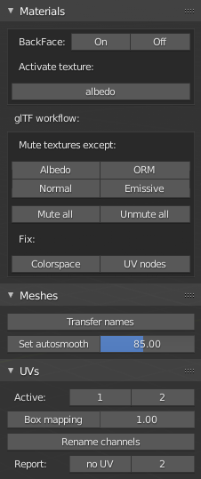

# ReTiCo

**Re**al **Ti**me **Co**mpanion, a Blender add-on made to work faster, oriented 3D realtime and glTF workflows.

[Changelog](https://github.com/Vinc3r/ReTiCo/blob/master/changelog.md).

## Installation

1. download [last version](https://github.com/Vinc3r/BlenderScripts/releases/latest)
2. in Blender go to *File* > *User Preferences* > *Add-ons* Tab
3. remove previous installation if needed (search *retico* to easily find it)
4. install by using *Install from File...* in *Blender User Preferences* > *Add-ons* tab

ReTiCo tools are now available in `3DView` > `Sidebar` > `ReTiCo` tab.

As I develop mainlky using last official Blender version, at activation you may seen this kind of warning: `This script was written Blender version 2.81.0 and migt not function (correctly), though it is enabled`. Don't worry, it should be OK.

## Documentation

This addon was made to help 3D realtime workflows, and also glTF import/export.

- <a href="#materials">Materials</a> panel
- <a href="#meshes">Meshes</a> panel
- <a href="#uvs">UVs</a> panel

### [*Material* panel](#materials)

On selected objects:

  - **BackFace On/Off**: toogle backface culling on materials setting, usefull in Look Dev viewport shading mode
  - **Activate texture node**:  set active texture node by type (albedo, ORM, Normal, Emissive), useful in Solid - Texture viewport mode
  - **Name from Object**: autoname materials using the following pattern `objName.matID.000`
  - **Report**: help user to find common material issues
  - glTF workflow:
    - **Mute textures except**: disable some texture nodes, useful for texture baking
    - **Fix**: try to detect some common issues
        - **Colorspace**: check if albedo & emit are using `sRGB` and other maps `Non-Color`
        - **UV links**: check if UV chan name in nodes is the same as mesh UV channel name ([example](_readmeAssets_/doc-wrong-uv-name.png))

### [*Meshes* panel](#meshes)

On selected objects:

  - **Transfer names**: copy Object name to Mesh name
  - **Set autosmooth**: overwrite autosmooth value and delete custom normals
  - **Copy names to clipboard**: as it says, send objects names to clipboard

### [*UVs* panel](#uvs)

On selected objects:

  - **Active**: make active first or second UV channel, create it if nonexistent
  - **Rename channels**: using the following pattern `UVMap`, `UV2`, `UV3`, etc
  - **Box mapping**: do a box mapping but using MagicUV algorithm (better than the default one). If user is in edit mode, only selected faces are affected
  - **Repot**: give info about objects with missing channels
